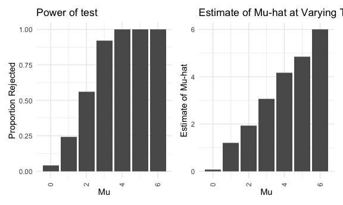

p8105_hw5_ag2965
================
Aakriti Shukla
2022-11-07

\#Problem 1

``` r
con_01 = read_csv("data/con_01.csv")
con_02 = read_csv("data/con_02.csv")
con_03 = read_csv("data/con_03.csv") 
con_04 = read_csv("data/con_04.csv") 
con_05 = read_csv("data/con_05.csv") 
con_06 = read_csv("data/con_06.csv") 
con_07 = read_csv("data/con_07.csv")
con_08 = read_csv("data/con_08.csv")
con_09 = read_csv("data/con_09.csv")
con_10 = read_csv("data/con_10.csv")
exp_01 = read_csv("data/exp_01.csv")
exp_02 = read_csv("data/exp_02.csv")
exp_03 = read_csv("data/exp_03.csv")
exp_04 = read_csv("data/exp_04.csv")
exp_05 = read_csv("data/exp_05.csv")
exp_06 = read_csv("data/exp_06.csv")
exp_07 = read_csv("data/exp_07.csv")
exp_08 = read_csv("data/exp_08.csv")
exp_09 = read_csv("data/exp_09.csv")
exp_10 = read_csv("data/exp_10.csv")
```

\#how to remove the data/ and the .csv?

``` r
prob1_df2<-data.frame(first_column=c("con_01","con_02","con_03","con_04","con_05"))
```

This zip file contains data from a longitudinal study that included a
control arm and an experimental arm. Data for each participant is
included in a separate file, and file names include the subject ID and
arm.

Create a tidy dataframe containing data from all participants, including
the subject ID, arm, and observations over time:

Start with a dataframe containing all file names; the list.files
function will help Iterate over file names and read in data for each
subject using purrr::map and saving the result as a new variable in the
dataframe Tidy the result; manipulate file names to include control arm
and subject ID, make sure weekly observations are “tidy”, and do any
other tidying that’s necessary Make a spaghetti plot showing
observations on each subject over time, and comment on differences
between groups.

\#Problem 2

The Washington Post has gathered data on homicides in 50 large U.S.
cities and made the data available through a GitHub repository here. You
can read their accompanying article here.

``` r
homicides_df <- read.csv(url("https://raw.githubusercontent.com/washingtonpost/data-homicides/master/homicide-data.csv"))%>%
  janitor::clean_names()

homicides_df_total=homicides_df%>%
  janitor::clean_names()%>%
  count()

homicides_df_state=homicides_df%>%
  janitor::clean_names()%>%
  group_by(state)%>%
  summarize

homicides_df_city=homicides_df%>%
  janitor::clean_names()%>%
  group_by(city)%>%
  summarize
```

Describe the raw data. There are 50 cities and 27 states in this
dataset. There are 52,179 total homicides represented in this
dataset.The variables included in this dataframe include the case ID,
the date the homicide was reported, the victim’s first and last name,
age, race, and sex, as well as the the following regarding the location
of the crime: the city and state and the latitude and longitude. There
is also data on the disposition of the case, which includes closed
without arrest, closed by arrest, and opened/no arrest. The dataset has
52179 rows and 12 columns in the dataset

``` r
unsolved_homicides=homicides_df%>%
  janitor::clean_names()%>%
    unite(city_state, c(city, state), sep = ", ")%>%
    group_by(city_state)%>%
    summarize(
      unsolved=sum(disposition=="Closed by arrest" | disposition=="Open/No arrest"),
      total=n())

unsolved_homicides%>%
  knitr::kable()
```

| city_state         | unsolved | total |
|:-------------------|---------:|------:|
| Albuquerque, NM    |      326 |   378 |
| Atlanta, GA        |      915 |   973 |
| Baltimore, MD      |     2675 |  2827 |
| Baton Rouge, LA    |      408 |   424 |
| Birmingham, AL     |      736 |   800 |
| Boston, MA         |      614 |   614 |
| Buffalo, NY        |      513 |   521 |
| Charlotte, NC      |      643 |   687 |
| Chicago, IL        |     5148 |  5535 |
| Cincinnati, OH     |      645 |   694 |
| Columbus, OH       |     1004 |  1084 |
| Dallas, TX         |     1489 |  1567 |
| Denver, CO         |      266 |   312 |
| Detroit, MI        |     2503 |  2519 |
| Durham, NC         |      265 |   276 |
| Fort Worth, TX     |      514 |   549 |
| Fresno, CA         |      464 |   487 |
| Houston, TX        |     2596 |  2942 |
| Indianapolis, IN   |     1220 |  1322 |
| Jacksonville, FL   |     1027 |  1168 |
| Kansas City, MO    |     1154 |  1190 |
| Las Vegas, NV      |     1206 |  1381 |
| Long Beach, CA     |      351 |   378 |
| Los Angeles, CA    |     2257 |  2257 |
| Louisville, KY     |      576 |   576 |
| Memphis, TN        |     1464 |  1514 |
| Miami, FL          |      681 |   744 |
| Milwaukee, wI      |     1078 |  1115 |
| Minneapolis, MN    |      335 |   366 |
| Nashville, TN      |      710 |   767 |
| New Orleans, LA    |     1336 |  1434 |
| New York, NY       |      610 |   627 |
| Oakland, CA        |      947 |   947 |
| Oklahoma City, OK  |      661 |   672 |
| Omaha, NE          |      399 |   409 |
| Philadelphia, PA   |     2945 |  3037 |
| Phoenix, AZ        |      818 |   914 |
| Pittsburgh, PA     |      631 |   631 |
| Richmond, VA       |      409 |   429 |
| Sacramento, CA     |      353 |   376 |
| San Antonio, TX    |      746 |   833 |
| San Bernardino, CA |      256 |   275 |
| San Diego, CA      |      397 |   461 |
| San Francisco, CA  |      662 |   663 |
| Savannah, GA       |      234 |   246 |
| St. Louis, MO      |     1637 |  1677 |
| Stockton, CA       |      433 |   444 |
| Tampa, FL          |      200 |   208 |
| Tulsa, AL          |        1 |     1 |
| Tulsa, OK          |      528 |   583 |
| Washington, DC     |     1271 |  1345 |

``` r
baltimore_homicides=unsolved_homicides%>%
  filter(city_state %in% "Baltimore, MD")
```

``` r
prop_unsolved=function(x_sum, n_total) {

proptest_unsolved=
  prop.test(
        x=x_sum,
        n=n_total,
        conf.level = 0.95, 
        alternative=c("two.sided"),
        correct = TRUE)%>%
  broom::tidy()%>%
   select(estimate,conf.low,conf.high)

proptest_unsolved
}

prop_unsolved(pull(baltimore_homicides,unsolved), pull(baltimore_homicides,total))
```

    ## # A tibble: 1 × 3
    ##   estimate conf.low conf.high
    ##      <dbl>    <dbl>     <dbl>
    ## 1    0.946    0.937     0.954

``` r
graph=unsolved_homicides%>%
  mutate(
    prop_unsolved_df = 
      map2(.x = unsolved, .y = total, ~prop_unsolved(x = .x, n = .y))
  ) %>% 
  unnest(prop_unsolved_df)

graph
```

    ## # A tibble: 51 × 6
    ##    city_state      unsolved total estimate conf.low conf.high
    ##    <chr>              <int> <int>    <dbl>    <dbl>     <dbl>
    ##  1 Albuquerque, NM      326   378    0.862    0.823     0.895
    ##  2 Atlanta, GA          915   973    0.940    0.923     0.954
    ##  3 Baltimore, MD       2675  2827    0.946    0.937     0.954
    ##  4 Baton Rouge, LA      408   424    0.962    0.938     0.978
    ##  5 Birmingham, AL       736   800    0.92     0.898     0.937
    ##  6 Boston, MA           614   614    1        0.992     1    
    ##  7 Buffalo, NY          513   521    0.985    0.969     0.993
    ##  8 Charlotte, NC        643   687    0.936    0.914     0.953
    ##  9 Chicago, IL         5148  5535    0.930    0.923     0.937
    ## 10 Cincinnati, OH       645   694    0.929    0.907     0.947
    ## # … with 41 more rows

``` r
  ggplot(data=graph, aes(x = fct_reorder(city_state, estimate), y = estimate)) +
geom_point() +
labs(x = "Location", y= "Proportion") +
geom_errorbar(aes(ymin = conf.low, ymax = conf.high), width = 0.5) +
  theme(axis.text.x = element_text(angle = 90, vjust = 0.5, hjust=1))+
    ggtitle("Proportion of Unsolved Homicides by Location")
```


For the city of Baltimore, MD, use the prop.test function to estimate
the proportion of homicides that are unsolved; save the output of
prop.test as an R object, apply the broom::tidy to this object and pull
the estimated proportion and confidence intervals from the resulting
tidy dataframe.

Now run prop.test for each of the cities in your dataset, and extract
both the proportion of unsolved homicides and the confidence interval
for each. Do this within a “tidy” pipeline, making use of purrr::map,
purrr::map2, list columns and unnest as necessary to create a tidy
dataframe with estimated proportions and CIs for each city.

Create a plot that shows the estimates and CIs for each city – check out
geom_errorbar for a way to add error bars based on the upper and lower
limits. Organize cities according to the proportion of unsolved
homicides.

\#Problem 3

When designing an experiment or analysis, a common question is whether
it is likely that a true effect will be detected – put differently,
whether a false null hypothesis will be rejected. The probability that a
false null hypothesis is rejected is referred to as power, and it
depends on several factors, including: the sample size; the effect size;
and the error variance. In this problem, you will conduct a simulation
to explore power in a one-sample t-test.

First set the following design elements:

Fix n=30 Fix σ=5 Set μ=0. Generate 5000 datasets from the model

x∼Normal\[μ,σ\]

For each dataset, save μ̂ and the p-value arising from a test of H:μ=0
using α=0.05. Hint: to obtain the estimate and p-value, use broom::tidy
to clean the output of t.test.

Repeat the above for μ={1,2,3,4,5,6}, and complete the following:

Make a plot showing the proportion of times the null was rejected (the
power of the test) on the y axis and the true value of μ on the x axis.
Describe the association between effect size and power. Make a plot
showing the average estimate of μ̂ on the y axis and the true value of μ
on the x axis. Make a second plot (or overlay on the first) the average
estimate of μ̂ only in samples for which the null was rejected on the y
axis and the true value of μ on the x axis. Is the sample average of μ̂
across tests for which the null is rejected approximately equal to the
true value of μ? Why or why not?

``` r
t_test = function(df){
  power_df <- t.test(df,
         alternative = c("two.sided"),
         mu = 0,
         conf.level = 0.95) %>%
    broom::tidy()
  return(power_df)
}

n_iter = 5

mu = 0

generate_results = function(mu = 0,
                            sigma = 5,
                            n_iter = 50,
                            n_obs = 30){

new_list = list()


for (i in 1:n_iter) {
  temp_vec = rnorm(n = n_obs, mean = mu, sd = sigma)
  new_list[[i]] = temp_vec
}


stats_tib =
  tibble(
    data = new_list
  ) %>%
  mutate(
    ttest_results = map(.x = data, ~t_test(.x))
  ) %>%
  unnest(ttest_results) %>%
  janitor::clean_names() %>%
  select(estimate, p_value)

fin_tib = stats_tib %>%
  mutate(
    rej = p_value < 0.05
  ) %>%
  summarize(
    tot = n(),
    tot_rej = sum(rej),
    prop_rej = tot_rej/tot,
    avg_mu_hat = mean(estimate)
  )
return(fin_tib)
}

generate_results()
```

    ## # A tibble: 1 × 4
    ##     tot tot_rej prop_rej avg_mu_hat
    ##   <int>   <int>    <dbl>      <dbl>
    ## 1    50       4     0.08    0.00515

``` r
new_tib =
  tibble(
    mu = c(0, 1, 2, 3, 4, 5, 6)
  ) %>%
  mutate(
    results = map(.x = mu, ~generate_results(mu = .x))) %>%
      unnest(results)

power_test=ggplot(data=new_tib, aes(x = mu, y = prop_rej)) +
geom_bar(stat="identity") +
labs(x = "Mu", y= "Proportion Rejected") +
  theme(axis.text.x = element_text(angle = 90, vjust = 0.5, hjust=1))+
    ggtitle("Power of test")
 
mu_hat_estimate=ggplot(data=new_tib, aes(x = mu, y = avg_mu_hat)) +
geom_bar(stat="identity") +
labs(x = "Mu", y= "Estimate of Mu-hat") +
  theme(axis.text.x = element_text(angle = 90, vjust = 0.5, hjust=1))+
    ggtitle("Estimate of Mu-hat at Varying True Values of Mu")

library(patchwork)
power_test + mu_hat_estimate
```



\`\`\` Make a second plot (or overlay on the first) the average estimate
of μ̂ only in samples for which the null was rejected on the y axis and
the true value of μ on the x axis. Is the sample average of μ̂ across
tests for which the null is rejected approximately equal to the true
value of μ? Why or why not?
