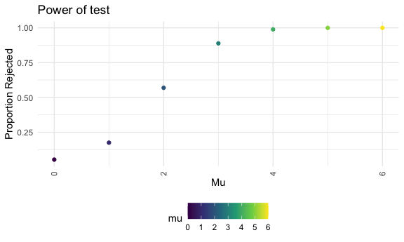

p8105_hw5_ag2965
================
Aakriti Shukla
2022-11-07

Due date: November 16, 2022

\#Problem 1 First, we loaded the data and joined the individual files
using the list.files and str_c() functions. We then iterated over file
names and read in the data for each subject.

``` r
longi_df = 
  tibble(
    files = list.files("data/"),
    path = str_c("data/", files)
  ) %>% 
  mutate(data = map(path, read_csv)) %>% 
  unnest(cols=c(data))
```

    ## Rows: 1 Columns: 8
    ## ── Column specification ────────────────────────────────────────────────────────
    ## Delimiter: ","
    ## dbl (8): week_1, week_2, week_3, week_4, week_5, week_6, week_7, week_8
    ## 
    ## ℹ Use `spec()` to retrieve the full column specification for this data.
    ## ℹ Specify the column types or set `show_col_types = FALSE` to quiet this message.
    ## Rows: 1 Columns: 8
    ## ── Column specification ────────────────────────────────────────────────────────
    ## Delimiter: ","
    ## dbl (8): week_1, week_2, week_3, week_4, week_5, week_6, week_7, week_8
    ## 
    ## ℹ Use `spec()` to retrieve the full column specification for this data.
    ## ℹ Specify the column types or set `show_col_types = FALSE` to quiet this message.
    ## Rows: 1 Columns: 8
    ## ── Column specification ────────────────────────────────────────────────────────
    ## Delimiter: ","
    ## dbl (8): week_1, week_2, week_3, week_4, week_5, week_6, week_7, week_8
    ## 
    ## ℹ Use `spec()` to retrieve the full column specification for this data.
    ## ℹ Specify the column types or set `show_col_types = FALSE` to quiet this message.
    ## Rows: 1 Columns: 8
    ## ── Column specification ────────────────────────────────────────────────────────
    ## Delimiter: ","
    ## dbl (8): week_1, week_2, week_3, week_4, week_5, week_6, week_7, week_8
    ## 
    ## ℹ Use `spec()` to retrieve the full column specification for this data.
    ## ℹ Specify the column types or set `show_col_types = FALSE` to quiet this message.
    ## Rows: 1 Columns: 8
    ## ── Column specification ────────────────────────────────────────────────────────
    ## Delimiter: ","
    ## dbl (8): week_1, week_2, week_3, week_4, week_5, week_6, week_7, week_8
    ## 
    ## ℹ Use `spec()` to retrieve the full column specification for this data.
    ## ℹ Specify the column types or set `show_col_types = FALSE` to quiet this message.
    ## Rows: 1 Columns: 8
    ## ── Column specification ────────────────────────────────────────────────────────
    ## Delimiter: ","
    ## dbl (8): week_1, week_2, week_3, week_4, week_5, week_6, week_7, week_8
    ## 
    ## ℹ Use `spec()` to retrieve the full column specification for this data.
    ## ℹ Specify the column types or set `show_col_types = FALSE` to quiet this message.
    ## Rows: 1 Columns: 8
    ## ── Column specification ────────────────────────────────────────────────────────
    ## Delimiter: ","
    ## dbl (8): week_1, week_2, week_3, week_4, week_5, week_6, week_7, week_8
    ## 
    ## ℹ Use `spec()` to retrieve the full column specification for this data.
    ## ℹ Specify the column types or set `show_col_types = FALSE` to quiet this message.
    ## Rows: 1 Columns: 8
    ## ── Column specification ────────────────────────────────────────────────────────
    ## Delimiter: ","
    ## dbl (8): week_1, week_2, week_3, week_4, week_5, week_6, week_7, week_8
    ## 
    ## ℹ Use `spec()` to retrieve the full column specification for this data.
    ## ℹ Specify the column types or set `show_col_types = FALSE` to quiet this message.
    ## Rows: 1 Columns: 8
    ## ── Column specification ────────────────────────────────────────────────────────
    ## Delimiter: ","
    ## dbl (8): week_1, week_2, week_3, week_4, week_5, week_6, week_7, week_8
    ## 
    ## ℹ Use `spec()` to retrieve the full column specification for this data.
    ## ℹ Specify the column types or set `show_col_types = FALSE` to quiet this message.
    ## Rows: 1 Columns: 8
    ## ── Column specification ────────────────────────────────────────────────────────
    ## Delimiter: ","
    ## dbl (8): week_1, week_2, week_3, week_4, week_5, week_6, week_7, week_8
    ## 
    ## ℹ Use `spec()` to retrieve the full column specification for this data.
    ## ℹ Specify the column types or set `show_col_types = FALSE` to quiet this message.
    ## Rows: 1 Columns: 8
    ## ── Column specification ────────────────────────────────────────────────────────
    ## Delimiter: ","
    ## dbl (8): week_1, week_2, week_3, week_4, week_5, week_6, week_7, week_8
    ## 
    ## ℹ Use `spec()` to retrieve the full column specification for this data.
    ## ℹ Specify the column types or set `show_col_types = FALSE` to quiet this message.
    ## Rows: 1 Columns: 8
    ## ── Column specification ────────────────────────────────────────────────────────
    ## Delimiter: ","
    ## dbl (8): week_1, week_2, week_3, week_4, week_5, week_6, week_7, week_8
    ## 
    ## ℹ Use `spec()` to retrieve the full column specification for this data.
    ## ℹ Specify the column types or set `show_col_types = FALSE` to quiet this message.
    ## Rows: 1 Columns: 8
    ## ── Column specification ────────────────────────────────────────────────────────
    ## Delimiter: ","
    ## dbl (8): week_1, week_2, week_3, week_4, week_5, week_6, week_7, week_8
    ## 
    ## ℹ Use `spec()` to retrieve the full column specification for this data.
    ## ℹ Specify the column types or set `show_col_types = FALSE` to quiet this message.
    ## Rows: 1 Columns: 8
    ## ── Column specification ────────────────────────────────────────────────────────
    ## Delimiter: ","
    ## dbl (8): week_1, week_2, week_3, week_4, week_5, week_6, week_7, week_8
    ## 
    ## ℹ Use `spec()` to retrieve the full column specification for this data.
    ## ℹ Specify the column types or set `show_col_types = FALSE` to quiet this message.
    ## Rows: 1 Columns: 8
    ## ── Column specification ────────────────────────────────────────────────────────
    ## Delimiter: ","
    ## dbl (8): week_1, week_2, week_3, week_4, week_5, week_6, week_7, week_8
    ## 
    ## ℹ Use `spec()` to retrieve the full column specification for this data.
    ## ℹ Specify the column types or set `show_col_types = FALSE` to quiet this message.
    ## Rows: 1 Columns: 8
    ## ── Column specification ────────────────────────────────────────────────────────
    ## Delimiter: ","
    ## dbl (8): week_1, week_2, week_3, week_4, week_5, week_6, week_7, week_8
    ## 
    ## ℹ Use `spec()` to retrieve the full column specification for this data.
    ## ℹ Specify the column types or set `show_col_types = FALSE` to quiet this message.
    ## Rows: 1 Columns: 8
    ## ── Column specification ────────────────────────────────────────────────────────
    ## Delimiter: ","
    ## dbl (8): week_1, week_2, week_3, week_4, week_5, week_6, week_7, week_8
    ## 
    ## ℹ Use `spec()` to retrieve the full column specification for this data.
    ## ℹ Specify the column types or set `show_col_types = FALSE` to quiet this message.
    ## Rows: 1 Columns: 8
    ## ── Column specification ────────────────────────────────────────────────────────
    ## Delimiter: ","
    ## dbl (8): week_1, week_2, week_3, week_4, week_5, week_6, week_7, week_8
    ## 
    ## ℹ Use `spec()` to retrieve the full column specification for this data.
    ## ℹ Specify the column types or set `show_col_types = FALSE` to quiet this message.
    ## Rows: 1 Columns: 8
    ## ── Column specification ────────────────────────────────────────────────────────
    ## Delimiter: ","
    ## dbl (8): week_1, week_2, week_3, week_4, week_5, week_6, week_7, week_8
    ## 
    ## ℹ Use `spec()` to retrieve the full column specification for this data.
    ## ℹ Specify the column types or set `show_col_types = FALSE` to quiet this message.
    ## Rows: 1 Columns: 8
    ## ── Column specification ────────────────────────────────────────────────────────
    ## Delimiter: ","
    ## dbl (8): week_1, week_2, week_3, week_4, week_5, week_6, week_7, week_8
    ## 
    ## ℹ Use `spec()` to retrieve the full column specification for this data.
    ## ℹ Specify the column types or set `show_col_types = FALSE` to quiet this message.

``` r
longi_df
```

    ## # A tibble: 20 × 10
    ##    files      path       week_1 week_2 week_3 week_4 week_5 week_6 week_7 week_8
    ##    <chr>      <chr>       <dbl>  <dbl>  <dbl>  <dbl>  <dbl>  <dbl>  <dbl>  <dbl>
    ##  1 con_01.csv data/con_…   0.2   -1.31   0.66   1.96   0.23   1.09   0.05   1.94
    ##  2 con_02.csv data/con_…   1.13  -0.88   1.07   0.17  -0.83  -0.31   1.58   0.44
    ##  3 con_03.csv data/con_…   1.77   3.11   2.22   3.26   3.31   0.89   1.88   1.01
    ##  4 con_04.csv data/con_…   1.04   3.66   1.22   2.33   1.47   2.7    1.87   1.66
    ##  5 con_05.csv data/con_…   0.47  -0.58  -0.09  -1.37  -0.32  -2.17   0.45   0.48
    ##  6 con_06.csv data/con_…   2.37   2.5    1.59  -0.16   2.08   3.07   0.78   2.35
    ##  7 con_07.csv data/con_…   0.03   1.21   1.13   0.64   0.49  -0.12  -0.07   0.46
    ##  8 con_08.csv data/con_…  -0.08   1.42   0.09   0.36   1.18  -1.16   0.33  -0.44
    ##  9 con_09.csv data/con_…   0.08   1.24   1.44   0.41   0.95   2.75   0.3    0.03
    ## 10 con_10.csv data/con_…   2.14   1.15   2.52   3.44   4.26   0.97   2.73  -0.53
    ## 11 exp_01.csv data/exp_…   3.05   3.67   4.84   5.8    6.33   5.46   6.38   5.91
    ## 12 exp_02.csv data/exp_…  -0.84   2.63   1.64   2.58   1.24   2.32   3.11   3.78
    ## 13 exp_03.csv data/exp_…   2.15   2.08   1.82   2.84   3.36   3.61   3.37   3.74
    ## 14 exp_04.csv data/exp_…  -0.62   2.54   3.78   2.73   4.49   5.82   6      6.49
    ## 15 exp_05.csv data/exp_…   0.7    3.33   5.34   5.57   6.9    6.66   6.24   6.95
    ## 16 exp_06.csv data/exp_…   3.73   4.08   5.4    6.41   4.87   6.09   7.66   5.83
    ## 17 exp_07.csv data/exp_…   1.18   2.35   1.23   1.17   2.02   1.61   3.13   4.88
    ## 18 exp_08.csv data/exp_…   1.37   1.43   1.84   3.6    3.8    4.72   4.68   5.7 
    ## 19 exp_09.csv data/exp_…  -0.4    1.08   2.66   2.7    2.8    2.64   3.51   3.27
    ## 20 exp_10.csv data/exp_…   1.09   2.8    2.8    4.3    2.25   6.57   6.09   4.64

We then tidied the result and manipulated file names to include the
control arm and subject ID. We also made sure that weekly observations
were tidied.

``` r
tidy_df = 
  longi_df %>% 
  mutate(
    files = str_replace(files, ".csv", ""),
    group = str_sub(files, 1, 3)) %>% 
  pivot_longer(
    week_1:week_8,
    names_to = "week",
    values_to = "outcome",
    names_prefix = "week_") %>% 
  mutate(week = as.numeric(week)) %>% 
  select(group, subj = files, week, outcome)

tidy_df
```

    ## # A tibble: 160 × 4
    ##    group subj    week outcome
    ##    <chr> <chr>  <dbl>   <dbl>
    ##  1 con   con_01     1    0.2 
    ##  2 con   con_01     2   -1.31
    ##  3 con   con_01     3    0.66
    ##  4 con   con_01     4    1.96
    ##  5 con   con_01     5    0.23
    ##  6 con   con_01     6    1.09
    ##  7 con   con_01     7    0.05
    ##  8 con   con_01     8    1.94
    ##  9 con   con_02     1    1.13
    ## 10 con   con_02     2   -0.88
    ## # … with 150 more rows

We then created 2 spaghetti plots to compare observations for control
and experimental groups. We can see that for the control group, the
outcome did not change or had a slight downward slope downward slope.
For the experimental group, the outcome had a positive slope over time.
These findings suggest that the experimental group experienced a change
over time, while the control group did not.

``` r
tidy_df %>% 
  ggplot(aes(x = week, y = outcome, group = subj, color = group)) + 
  geom_point() + 
  geom_path() + 
  facet_grid(~group)+
labs(x = "Week", y= "Outcome") +
  theme(axis.text.x = element_text(angle = 90, vjust = 0.5, hjust=1))+
    ggtitle("Observations Over Time For Control and Experimental Arms")
```


\#Problem 2

Homicide data in 50 large U.S. cities - The Washington Post data

Let’s load the data.

``` r
homicides_df <- read.csv(url("https://raw.githubusercontent.com/washingtonpost/data-homicides/master/homicide-data.csv"))%>%
  janitor::clean_names()

homicides_df_total=homicides_df%>%
  janitor::clean_names()%>%
  count()

homicides_df_state=homicides_df%>%
  janitor::clean_names()%>%
  group_by(state)%>%
  summarize

homicides_df_city=homicides_df%>%
  janitor::clean_names()%>%
  group_by(city)%>%
  summarize
```

There are 50 cities and 27 states in this dataset. There are 52,179
total homicides represented in this dataset.The variables included in
this dataframe include the case ID, the date the homicide was reported,
the victim’s first and last name, age, race, and sex, as well as the the
following regarding the location of the crime: the city and state and
the latitude and longitude. There is also data on the disposition of the
case, which includes closed without arrest, closed by arrest, and
opened/no arrest. The dataset has 52179 rows and 12 columns.

Below, we have created a table with the number of unsolved and total
homicides by city. Unsolved homicides are those that have a disposition
of “Closed by arrest” or “Open/No arrest”.

``` r
unsolved_homicides=homicides_df%>%
  janitor::clean_names()%>%
    unite(city_state, c(city, state), sep = ", ")%>%
    mutate(
      city_state=case_when(city_state=="Tulsa, AL" ~ "Tulsa, OK", TRUE~city_state)
    )%>%
    group_by(city_state)%>%
    summarize(
      unsolved=sum(disposition=="Closed by arrest" | disposition=="Open/No arrest"),
      total=n())

unsolved_homicides%>%
  knitr::kable()
```

| city_state         | unsolved | total |
|:-------------------|---------:|------:|
| Albuquerque, NM    |      326 |   378 |
| Atlanta, GA        |      915 |   973 |
| Baltimore, MD      |     2675 |  2827 |
| Baton Rouge, LA    |      408 |   424 |
| Birmingham, AL     |      736 |   800 |
| Boston, MA         |      614 |   614 |
| Buffalo, NY        |      513 |   521 |
| Charlotte, NC      |      643 |   687 |
| Chicago, IL        |     5148 |  5535 |
| Cincinnati, OH     |      645 |   694 |
| Columbus, OH       |     1004 |  1084 |
| Dallas, TX         |     1489 |  1567 |
| Denver, CO         |      266 |   312 |
| Detroit, MI        |     2503 |  2519 |
| Durham, NC         |      265 |   276 |
| Fort Worth, TX     |      514 |   549 |
| Fresno, CA         |      464 |   487 |
| Houston, TX        |     2596 |  2942 |
| Indianapolis, IN   |     1220 |  1322 |
| Jacksonville, FL   |     1027 |  1168 |
| Kansas City, MO    |     1154 |  1190 |
| Las Vegas, NV      |     1206 |  1381 |
| Long Beach, CA     |      351 |   378 |
| Los Angeles, CA    |     2257 |  2257 |
| Louisville, KY     |      576 |   576 |
| Memphis, TN        |     1464 |  1514 |
| Miami, FL          |      681 |   744 |
| Milwaukee, wI      |     1078 |  1115 |
| Minneapolis, MN    |      335 |   366 |
| Nashville, TN      |      710 |   767 |
| New Orleans, LA    |     1336 |  1434 |
| New York, NY       |      610 |   627 |
| Oakland, CA        |      947 |   947 |
| Oklahoma City, OK  |      661 |   672 |
| Omaha, NE          |      399 |   409 |
| Philadelphia, PA   |     2945 |  3037 |
| Phoenix, AZ        |      818 |   914 |
| Pittsburgh, PA     |      631 |   631 |
| Richmond, VA       |      409 |   429 |
| Sacramento, CA     |      353 |   376 |
| San Antonio, TX    |      746 |   833 |
| San Bernardino, CA |      256 |   275 |
| San Diego, CA      |      397 |   461 |
| San Francisco, CA  |      662 |   663 |
| Savannah, GA       |      234 |   246 |
| St. Louis, MO      |     1637 |  1677 |
| Stockton, CA       |      433 |   444 |
| Tampa, FL          |      200 |   208 |
| Tulsa, OK          |      529 |   584 |
| Washington, DC     |     1271 |  1345 |

We then created a dataframe for homicides in Baltimore and used the
prop.test function to estimate the proportion of homicides that are
unsolved.

``` r
baltimore_homicides=unsolved_homicides%>%
  filter(city_state %in% "Baltimore, MD")
```

``` r
prop_unsolved=function(x_sum, n_total) {

proptest_unsolved=
  prop.test(
        x=x_sum,
        n=n_total,
        conf.level = 0.95, 
        alternative=c("two.sided"),
        correct = TRUE)%>%
  broom::tidy()%>%
   select(estimate,conf.low,conf.high)

proptest_unsolved
}

prop_unsolved(pull(baltimore_homicides,unsolved), pull(baltimore_homicides,total))
```

    ## # A tibble: 1 × 3
    ##   estimate conf.low conf.high
    ##      <dbl>    <dbl>     <dbl>
    ## 1    0.946    0.937     0.954

We then used this function to for each of the cities in the dataset and
extracted the proportion of unsolved homicides and the confidence
interval for each using the purrr::map2 function. We also creatd a plot
that shows the estimates and CIs for each city along with error bars.
This plot shows us that the great majority of homicides are unsolved in
all locations. The lowest proportion of unsolved homicides were in
Denver, San Diego, and Albuquerque, and the highest were in Louisville,
Oakland, and Pittsburgh.

``` r
unsolved_cities=unsolved_homicides%>%
  mutate(
    prop_unsolved_df = 
      map2(.x = unsolved, .y = total, ~prop_unsolved(x = .x, n = .y))
  ) %>% 
  unnest(prop_unsolved_df)

unsolved_cities
```

    ## # A tibble: 50 × 6
    ##    city_state      unsolved total estimate conf.low conf.high
    ##    <chr>              <int> <int>    <dbl>    <dbl>     <dbl>
    ##  1 Albuquerque, NM      326   378    0.862    0.823     0.895
    ##  2 Atlanta, GA          915   973    0.940    0.923     0.954
    ##  3 Baltimore, MD       2675  2827    0.946    0.937     0.954
    ##  4 Baton Rouge, LA      408   424    0.962    0.938     0.978
    ##  5 Birmingham, AL       736   800    0.92     0.898     0.937
    ##  6 Boston, MA           614   614    1        0.992     1    
    ##  7 Buffalo, NY          513   521    0.985    0.969     0.993
    ##  8 Charlotte, NC        643   687    0.936    0.914     0.953
    ##  9 Chicago, IL         5148  5535    0.930    0.923     0.937
    ## 10 Cincinnati, OH       645   694    0.929    0.907     0.947
    ## # … with 40 more rows

``` r
  ggplot(data=unsolved_cities, aes(x = fct_reorder(city_state, estimate), y = estimate)) +
geom_point() +
labs(x = "Location", y= "Proportion") +
geom_errorbar(aes(ymin = conf.low, ymax = conf.high), width = 0.5) +
  theme(axis.text.x = element_text(angle = 90, vjust = 0.5, hjust=1))+
    ggtitle("Proportion of Unsolved Homicides by Location")
```


\#Problem 3

We created a simulation to explore power in a one-sample t-test with the
following design elements: n=30, σ=5, μ=0 and we generated 5000 datasets
from the mode. For each dataset, we have saved μ̂ and the p-value arising
from a test of H:μ=0 using α=0.05.I have repeated this for
μ={1,2,3,4,5,6}.

``` r
t_test_clean = function(df){
  out_df <- t.test(df,
         alternative = c("two.sided"),
         mu = 0,
         conf.level = 0.95) %>%
    broom::tidy()
  return(out_df)
}

generate_results = function(mu = 0,
                            sigma = 5,
                            n_iter = 50,
                            n_obs = 30){

new_list = list()


for (i in 1:n_iter) {
  temp_vec = rnorm(n = n_obs, mean = mu, sd = sigma)
  new_list[[i]] = temp_vec
}


stats_tib =
  tibble(
    data = new_list
  ) %>%
  mutate(
    ttest_results = map(.x = data, ~t_test_clean(.x))
  ) %>%
  unnest(ttest_results) %>%
  janitor::clean_names() %>%
  select(estimate, p_value)

fin_tib = stats_tib %>%
  mutate(
    rej = p_value < 0.05
  ) %>%
  summarize(
    tot = n(),
    tot_rej = sum(rej),
    prop_rej = tot_rej/tot,
    avg_mu_hat = mean(estimate)
  )
return(fin_tib)
}


generate_results()
```

    ## # A tibble: 1 × 4
    ##     tot tot_rej prop_rej avg_mu_hat
    ##   <int>   <int>    <dbl>      <dbl>
    ## 1    50       4     0.08    -0.0800

``` r
new_tib =
  tibble(
    mu = c(0, 1, 2, 3, 4, 5, 6)
  ) %>%
  mutate(
    results = map(.x = mu, ~generate_results(mu = .x))) %>%
      unnest(results)
```

Below, I have made a plot showing the proportion of times the null was
rejected (the power of the test) on the y axis and the true value of μ
on the x axis. I have found that as effect size increases, as does
power.

``` r
power_test=new_tib%>%
  ggplot(aes(x = mu, y = prop_rej)) +
  geom_point(aes(color = mu))+
labs(x = "Mu", y= "Proportion Rejected") +
  theme(axis.text.x = element_text(angle = 90, vjust = 0.5, hjust=1))+
    ggtitle("Power of test")

power_test
```



Below, I have made a plot (left panel) showing the average estimate of μ̂
on the y axis and the true value of μ on the x axis.

``` r
mu_hat_estimate=new_tib%>%
    ggplot(aes(x = mu, y = avg_mu_hat)) +
  geom_point(aes(color = mu))+
labs(x = "Mu", y= "Estimate of Mu-hat") +
  theme(axis.text.x = element_text(angle = 90, vjust = 0.5, hjust=1))+
    ggtitle("Mu-hat at True Values of Mu")
```

We then made a second plot with the average estimate of μ̂ only in
samples for which the null was rejected on the y axis and the true value
of μ on the x axis. The sample average of mu-hat for across tests for
which the null hypothesis is rejected is not equal to the true value of
mu because these samples were sufficiently different than mu, as this
incldued only those values in which the null hypothesis was rejected.

``` r
t_test_clean = function(df){
  out_df <- t.test(df,
         alternative = c("two.sided"),
         mu = 0,
         conf.level = 0.95) %>%
    broom::tidy()
  return(out_df)
}

generate_results_rej = function(mu = 0,
                            sigma = 5,
                            n_iter = 50,
                            n_obs = 30){

new_list_rej = list()


for (i in 1:n_iter) {
  temp_vec = rnorm(n = n_obs, mean = mu, sd = sigma)
  new_list_rej[[i]] = temp_vec
}


stats_tib_rej =
  tibble(
    data = new_list_rej
  ) %>%
  mutate(
    ttest_results = map(.x = data, ~t_test_clean(.x))
  ) %>%
  unnest(ttest_results) %>%
  janitor::clean_names() %>%
  select(estimate, p_value)

fin_tib_rej = stats_tib_rej %>%
  mutate(
    rej = p_value < 0.05
  ) %>%
  summarize(
    tot = n(),
    tot_rej = sum(rej),
    prop_rej = tot_rej/tot,
    avg_mu_hat = mean(estimate)
  )
return(fin_tib_rej)
}


new_tib_rej =
  tibble(
    mu = c(0, 1, 2, 3, 4, 5, 6)
  ) %>%
  mutate(
    results_rej = map(.x = mu, ~generate_results_rej(mu = .x))) %>%
      unnest(results_rej)

rejected=new_tib_rej%>%
  ggplot(aes(x=mu,y=avg_mu_hat))+
  geom_point(aes(color=mu))
```

``` r
rejected = new_tib_rej %>%
  ggplot(aes(x = mu, y = avg_mu_hat)) +
  geom_point(aes(color = mu))+
  labs(x = "Mu", y= "Estimate of Mu-hat") +
  theme(axis.text.x = element_text(angle = 90, vjust = 0.5, hjust=1))+
    ggtitle("Mu-hat at Mu for Rejected Cases")

library(patchwork)
mu_hat_estimate + rejected
```


